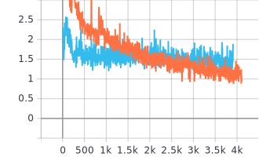
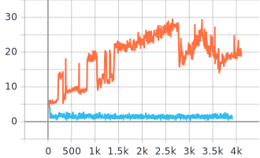

# Weight Sharing Between Generator & Discriminator

현재 GAN모델은 Generator와 Discriminator 두 모델의 가중치를 따로 학습시킨다. \
그러나 예술가들이 그림을 그릴때를 생각해보면, 어떤 사물을 인식하는 것과 떠올리는 것은 같은 구조로 이루어진다. \
만약 사과에 대해 인식을 한다면, 사과의 모양과 색을 공부하고, 이후 머릿속에 있는 지식들로 다시 사과를 그릴 수 있다. \
본 프로젝트는 위와 같은 개념에서 출발했으며, 2021-02-04 기준 모델의 초안을 구성한 상태다.

## Overview

Discriminator의 가중치들을 그대로 Generator에서 사용하기 위해선, Generator에 TransConv뿐만 아니라 Conv Layer 역시 시용해야 했다. \
따라서 Generator를 구성할때, TransConv 사이에 Conv Layer를 쌓는 방향으로 모델을 구성했다. \
이때 TransConv의 filter size를 Discriminator의 Conv filter size와 같은 크기로 맞추는 방식으로 output의 크기를 조정했다.

예를 들어 Discriminator의 각 레이어 output이 9 5 3 1순이라면, \
Generator 모듈역시 output을  1 3 5 9순으로 맞춘다. 

이때 1에서 3으로 output을 맞추는 과정처럼, output이 한단계 올라가는 과정을 MiddleBlock모듈로 구성했다. \
MiddleBlock모듈에서는 TransConv와 Conv Layer를 같이 사용하게된다.

예를 들어 MiddleBlock을 이용해 1에서 3으로 output을 올린다고 하겠다. \
이 경우 1에서 3으로 output을 1차로 증가시키기 위해 TranConv를 사용하고, 다시 두번째 Transconv를 사용하여 3에서 5로 output을 2차로 증가시킨다.  \
그러면 Discriminator에서 output을 5에서 3으로 조정한 Conv Layer의 가중치를 사용하여, 5로 올라간 Generator의 output을 다시 3으로 감소시킨다. \
이와 같은 방식으로 Discriminator의 정보와 Generator의 정보를 같이 이용한다.

매 step마다 Discriminator가 업데이트되므로, 주기적으로 Generator의 Conv Layer weight들에 Discriminator를 복사한다. \
이때 Generator의 Backward는 Conv Layer에서 detach했다. 이는 실험 결과를 반영했는데, GAN 모델이 너무 깊어지면 Generator의 훈련이 제대로 되지 않았다. \
두가지 가설을 세웠는데, 하나는 Generator의 Conv Layer가 예상한 Grad를 사용하지 않고 Discriminator의 weight를 복사해서 훈련이 제대로 되지 않는 것. \
두번째는 일반적인 GAN과 같이 너무 Deep한 경우 Generator가 훈련이 잘 되지 않는 다는 점이다. \
본 모델의 경우 1/3정도의 weigh들은 수렴을 하는 상태이다. (MiddleBlock 하나당 TransConv 2개, Conv 1개) \
따라서 2번째보단 1번째 가설과 더 가까울 것이라 예측했고, 이를 해소하기 위해 TransConv에서 Conv로 이동할때 두 경로로 나눠 1x1Conv를 사용해 Conv부분은 detach를 했다. \
결과적으로보면 아무 의미가 없었다. 아마도 1/3부분이 너무 빨리 수렴해서 2/3부분과 동떨어지는 것이 문제인 것 같다.

이 외의 특이점이라면, cGAN의 형식을 이용했다.
다만 Embedding Vec대신 Discriminator를 Classify 모델처럼 훈련시키고, 마지막 layer의 parameter들을 noize vec으로 사용했다. 물론 RandomNess를 위해 random vec도 ConCat시켜 사용했다. \
예를 들면, MNIST의 경우 Discriminator의 마지막 layer의 weight는 10 * filter_size * filter_size형식이다. 이때 각 label을 인덱스로 사용하여 noise vec(이 경우엔 matrix지만)을 구성한 것. \
추가로, 본 모델은 Model Collapse가 잘 일어났다. 이 부분을 해결하기 위해선 random vec의 영향을 키워야 할 것으로 생각된다. 현재는 같은 label들의 pixel difference를 ascent하는 방식으로 RandomNess를 키우는 중이다.

  

## MNIST Result
  
  
  
0 epoch 100 step

  
2 epoch 100 step

  
4 epoch 100 step

  

## Loss Graph
 

-주황색 : 10Layer  
-파란색 : 4Layer

결과에서 보이듯 4Layer를 사용했을 경우 준수한 성적을 보이지만, 10개로 늘어나는 경우 모델의 훈련이 망가진다.